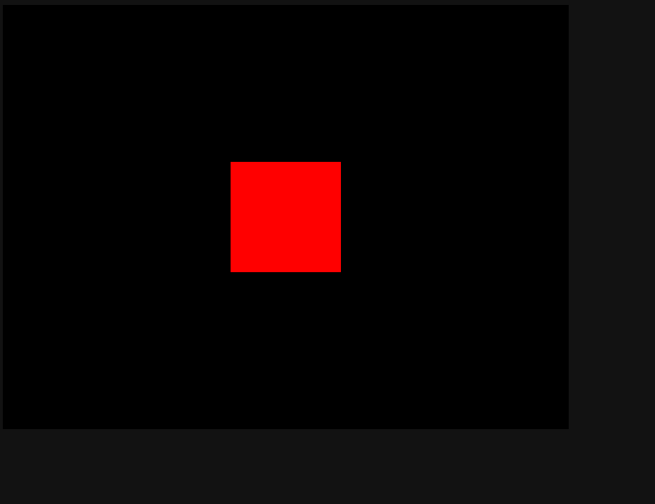
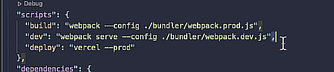

# How to reverse-engineer a 3JS Site Notes

<https://kittytreeplanner.neocities.org/kittycad/>

### *Packages Used*
1. Vite: Makes angular faster. It will optimize the files, cache breaking/emptying, source mapping (when source is minified), and you can run a local server for testing!
2. 3JS
3. React (plugin)
4. NPM
5. Angular
6. GLSL (plugin)

### PART ONE. Start with your Environment

1. Install Angular

    npm install -g @angular/cli@latest

*Make sure you are in the correct folder*
cd documents/github/[myprojectfolder]/Angular/[specificprojectname]

2. Make a new project folder

    ng new [my-first-app] --no-strict

Choose "CSS"

3. Install Bootstrap

    npm install --save bootstrap@5

4. Add Bootstrap to the angular.JSON file

node_modules/bootstrap/dist/css/bootstrap.min

5. Install 3JS

    npm install --save three

6. Install 3JS Type Definitions

    npm install --save @types/three

7. Quick-test your webpage

    ng serve

***************This is beyond standard Angular stuff now***

8. Install Node. You can check if it's installed with this too:

    node -v

9. Go into your practice files folder!!

10. Install NodeJS (y is for yes). It creates the package.json file

    npm init -y

11. Install Vite

    npm install vite

12. !!!IMPORTANT!!!

When you share DELETE these two packages to prevent node modules from getting messy

- package.json
- package-lock.json

13. Making a basic website, yaaaay!!

3JS will NOT WORK by just opening the html page!

Okay, after you are ready put in the magic words...

    npm run dev

IT WORKS! Because of a server run by vite.

*"Build" will output the FINAL version of the website*
==================================================================================================================================================================
### PART TWO: We can actually start coding stuff now that the basics are set

1. Debug on other devices

OMGGG you can log on to the URL while you're config for computer. Based.

2. Physically Based Rendering (PBR)

How we get realistic lighting based on the sandwhich layers of textures!

3. Slapping texture on the cube

==================================================================================================================================================================
### PART THREE: Going LIVE! To share our cool stuff

- You can't just throw your files on a traditional hosting site... you need to export

    npm run build

*We are now using VITE insteadl of Webpack, but the config and behavior are the same*

The "dist" folder is the one you want to upload online! If you already have the folder it will just overwrite them again

NOW FORGET THAT! WE'RE USING VERCEL!

    npm i -g vercel

add to the package.json

Then we log in to Vercel
    npm run deploy

