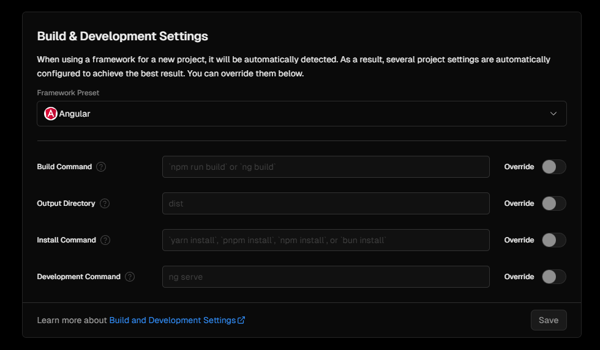

# How to reverse-engineer a 3JS Site Notes

<https://kittytreeplanner.neocities.org/kittycad/>

### *Packages Used*
1. Vite: Makes angular faster. It will optimize the files, cache breaking/emptying, source mapping (when source is minified), and you can run a local server for testing!
2. 3JS
3. React (plugin)
4. NPM
5. Angular
6. GLSL (plugin)

* /******************************************************************/

### PART ONE. Start with your Environment

#### 1. Install Angular

    npm install -g @angular/cli@latest

*Make sure you are in the correct folder*
cd documents/github/[myprojectfolder]/Angular/[specificprojectname]

#### 2. Make a new project folder

    ng new [my-first-app] --no-strict

Choose "CSS"

#### 3. SKIP Bootstrap (IT causes issues when exporting, figure out later)

#### 4. Add Bootstrap to the angular.JSON file

"node_modules/bootstrap/dist/css/bootstrap.min"

####  5. Install 3JS

    npm install --save three

6. Install 3JS Type Definitions

    npm install --save @types/three

***************This is beyond standard Angular stuff now***

8. Install Node. You can check if it's installed with this too:

    node -v

9. Install NodeJS (y is for yes). It creates the package.json file

    npm init -y

10. Install Vite

    npm install vite

11. !!!IMPORTANT!!!

When you share DELETE these two packages to prevent node modules from getting messy

- package.json
- package-lock.json

12. Making a basic website, yaaaay!!

3JS will NOT WORK by just opening the html page!

This worked because I was NOT using Angular...

*"Build" will output the FINAL version of the website*
==================================================================================================================================================================
### PART TWO: We can actually start coding stuff now that the basics are set

*To be used with 10-textures*

1. Debug on other devices

OMGGG you can log on to the URL while you're config for computer. Based.

2. Physically Based Rendering (PBR)

How we get realistic lighting based on the sandwhich layers of textures!

3. Slapping texture on the cube

==================================================================================================================================================================
### PART THREE: Going LIVE! To share our cool stuff

OH WOW! Is there a template JUST for Angular?!

<https://vercel.com/guides/deploying-angular-with-vercel>

*Note to self, just select the project's name folder, the one you name when you are doing step 2 in part one, the (ng new [my-first-app] --no-strict)

- You can't just throw your files on a traditional hosting site... you need to export

    npm run build

*We are now using VITE insteadl of Webpack, but the config and behavior are the same*

The "dist" folder is the one you want to upload online! If you already have the folder it will just overwrite them again

NOW FORGET THAT! WE'RE USING VERCEL!

    npm i -g vercel

If you need to update your version
    npm i -g vercel@latest

Updating latest version of uuid:
    npm install uuid@latest

add to the package.json

Then we log in to Vercel
    npm run deploy

(make sure it's your entire project. If it's portions like in here, best to export as a NEW project and one at a time... for testing)

If it's not doing npm run dev... something is up

<https://www.youtube.com/watch?v=y2ubmHHS2RU>

VERY COOL. It can auto configure for the project or you can set your own.

Angular is already here (you can skip to 5:04)

